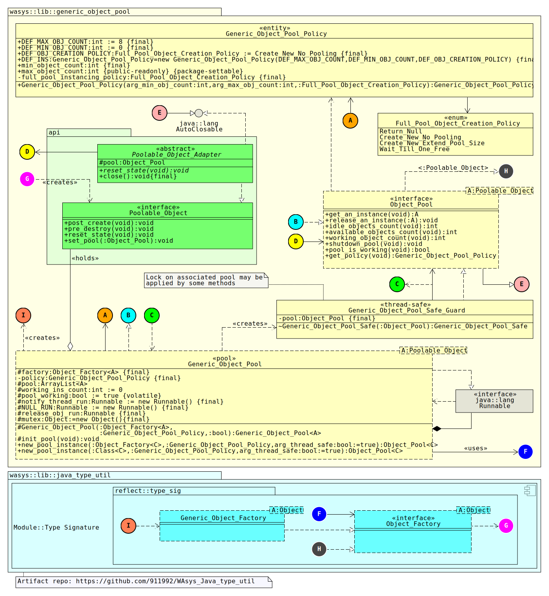
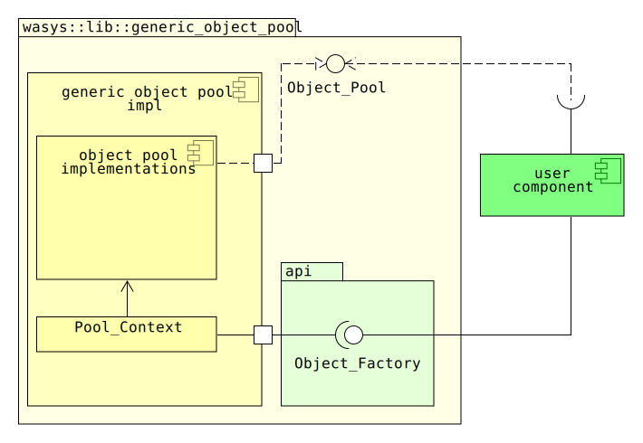
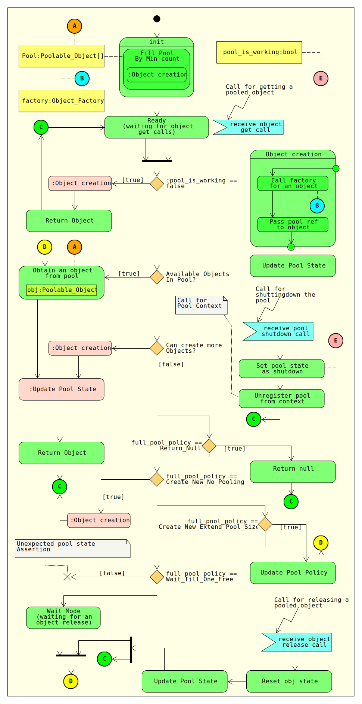

# WAsys_generic_object_pool
A very simple and generic Object Pooling pattern implementation.

## Revision History
*(NOTE: following list carries mentionable(not all) changes. For detailed changes, check source code(s))*

**0.2** (May 8, 2020)

0. `Source_Code::all`
    * Update all files info headers into non javadoc(simple multiline comment) format.
1. `Source_Code::Generic_Object_Pool`
    * Added shutdown guard check
    * Calling for unregister the pool instance by shutdown call
2. `Source_Code::Generic_Object_Pool_Policy`
    * Implemented/override the `equals(:Object):bool` method (automated by netbeans, thanks)
    * Added `IndexOutOfBoundsException` throwable exception for constructor method signature
3. `Source_Code::Generic_Object_Pool_Safe_Guard`
    * Mark the `close(void):void` method synchronized
4. `Source_Code::Object_Pool`
    * Added `is_registered(void):bool` and `get_policy(void):Generic_Object_Pool_Policy` methods
5. `Source_Code::Object_Pool_Type_Wrapper`
    * Removed constructor `Object_Pool_Type_Wrapper(:Object_Factory,:bool)`
6. `Source_Code::Pool_Context`
    * Updated policy to find an already working pool in context, using both factory and policy vars
    * Added `unregister_pool(:Object_Pool,:bool):void` method to allow unregister a pool from context
    * Removed `register_pool(...):Object_Pool` methods, no more needed
    * Added `get_pool`, `get_pool_registered_synced`, and `get_pool_unregistered_synced` method(s)
    * Using default `Generic_Object_Pool_Policy` when null ptr is given
    * Type check on unregister pool to make sure given arg is not a out-of-context instance
7. `Source_Code::Pool_Context`
    * Check for associated pool null-check before call the release method
8. Repo
    * Updated FAQ section in this file

9. Diagrams
    * Updated class diagram
    * Updated activity|state diagram

**Initial Release 0.1** (May 6, 2020)

## Requirements
0. Java 1.7 or later

## Class Diagram

## Composition Structure

## Overview
Implementation of a basic/generic Object Pooling(Interning) pattern in Java. Considering following characteristics of the implementation.

### Objection Creation
Object instansing(creation) **must** be implemented/provided by user. There is **no any** module to perform object creation automatically(considering using reflection, whatever...). `Object_Factory` is the interface need to implemnted by user. Function `create_object(void):Poolable_Object` is called by pool context when a new instance of target pool is requried.

### Poolable Object Type
Any poolable entity/bean must implements `Poolable_Object` or extend `Poolable_Object_Adapter` to be considered as a poolable instances. **NOTE:** Object state resetting is a user must be done stuff should be considered, since there is no any clue(or automated script/run) to reset a bean before gets acquired and used from an object pool.(considering `Poolable_Object::reset_state(void):void` method)

### Releasing An Object
This is up to user to either release a pooled object back to the related pool, or not. Either ways method `release_an_instance(:Poolable_Object):void` of related `Object_Pool` must be called with a usable non-`null` object, or `null` to inform pool update its counting state.
**HINT:** This is recommended to implement `java::lang::AutoClosable` or extend `Poolable_Object_Adapter`(which is a closable), and use the required object inside a 'try-with_resource'(`try(){}`) to release the `Poolable_Object` when it's no more required.

## Utilizing The Artifact(hands on)
Considering following steps need to be done in order to utilize this Object Pool.
1. The type need to be pooled(e.g. `Foo_Barr_Entity_Class`) should eitehr extend class `Poolable_Object_Adapter` or implement `Poolable_Object`. **NOTE:** Make sure method `reset_state(void):void` is correctly implemnted.
2. Implement interface `Object_Factory` and its `create_object(void):Poolable_Object`. Instance a non-`null` object, and return. **NOTE:** Objetc pool may not count any `null` instance by provided `Object_Factory`
3. (optional, but recommended)Prepare an insatnce of `Generic_Object_Pool_Policy` that fits your requirements about object pooling behaivior and state.
4. Ask for an `Object_Pool` instance from class `Pool_Context`, or instancing an `Object_Pool_Type_Wrapper` class.

## `Generic_Object_Pool` Activity | State Diagram

### Sample Usage
You may check [this repo]([)https://github.com/911992/WAsys_simple_generic_object_pool_sample_usage)

## FAQ
**Q0: How does `get_pool`(or `get_pool_unregistered_synced`, `get_pool_registered_synced`) function in `Pool_Context` provide an instance of `Object_Pool`?**
A: Each `Object_Pool` in context is associated to given `arg_factory` and `arg_pool_policy` args. So if any previously created `Object_Pool` impl(`Generic_Object_Pool`) were created, it would the result(shared-instance), otherwise a new `Object_Pool` object will be created and return.

**Q1: What if user forgets to release an `Poolable_Object`?**
A: Please don't. The Default `Generic_Object_Pool` implementation may not keep instances of working instances, so for any forgotten releasing objects, there will be no any mem-leak, but inconsistency for `Object_Pool`.

**Q2: What if user forgets to implement the `reset_state(void):void` method on target `Poolable_Object` type?**
A: Please don't. There will be no explicite problem related to pool context/object, but this may bring some inconsistency for user business part.

**Q3: What is the different(s) between obtaining an `Object_Pool` using `Pool_Context`, or `new`ing an `Object_Pool_Type_Wrapper`?**
A: Type `Object_Pool_Type_Wrapper` will actually call `Pool_Context`. If wrapping object(`Poolable_Object` -> `<<implemented type>>`) is not a big-deal for user, you may better use `Pool_Context` way(recommended). Actually `Object_Pool_Type_Wrapper` works as a type wrapper between actual desired user type, and `Poolable_Object`

**Q4: What if calling for a new objects from an already shutdown `Object_Pool`?**
A: `Object_Pool` will call the associated factory for object creation, but will not count new creation calls when a pool is in shutdown state.

## Troubleshooting
**T0: `Object_Pool::get_an_instance(void):Poolable_Object` instance, returns a `null` object**
This is related to related/given `Object_factory`, make sure the implemented type works well.

**T1: Thread endless wait on `Object_Pool::get_an_instance(void):Poolable_Object` call**
Only debugging could say, but considerring following possible scenarios.
Reason 0: This is probably related to related/given `Generic_Object_Pool_Policy`, as `full_pool_instancing_policy := Wait_Till_One_Free`. It means current thread have to waint until anotehr thread release one object, so it could be recycled/reuse for current trhead/call.
Reason 1: Related/given `Object_Factory` causes the thread lock, make sure it's implemented right.

## TODOs
- [ ] documenting the source code(maybe next decade :D, it hurts!)
- [ ] more sample usage
- [ ] more control for pooled object at `Object_Pool` level